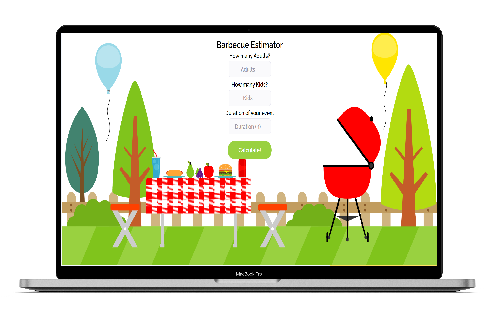

	
  

  
  

 <h2>Project developed on <a href="https://programadorbr.com/">ProgramadorBR</a> course.  </h2>

  

  <a href="#clipboard-about-the-project">About the Project</a>&nbsp;&nbsp;&nbsp;|&nbsp;&nbsp;&nbsp;
  <a href="#computer-technologies">Technology</a>&nbsp;&nbsp;&nbsp;|&nbsp;&nbsp;&nbsp;
  <a href="#arrow_double_up-future-upgrades">Future Upgrades</a>&nbsp;&nbsp;&nbsp;|&nbsp;&nbsp;&nbsp;

## :clipboard: About the Project

Web Page developed to calculate how much it is needed for a Barbecue Party 
Reference parameters are as follows:
 
Meat - 400gr per Person. If more than 6hours -> 650gr.
 
Beer - 1200ml per Person. If more than 6hours -> 2000ml.
 
Beverages - 1000ml per Person. If more than 6hours -> 1500ml.
  
*For kids parameters are halved (0,5). Beer parameters are not applied to Kids.

## :computer: Technologies: 

This project was developed applying:

- HTML
- CSS
- JavaScript

## ⏫ Future Upgrades:

- Add different kinds of meat
- Add Vegetarian options
- Add option that changes quantity result based on how hungry the party is

This project is under MIT license. Check the file [LICENSE](https://github.com/carlossantospx/barbecue-estimator/blob/main/LICENSE) for more details.
